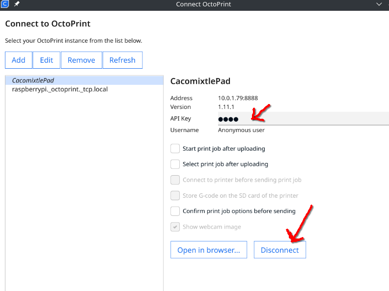

# CacomixtlePad Android App

<div align="center">
  
</div>

<br>

[Cacomixtle](https://unamglobal.unam.mx/global_revista/cacomixtle-adaptaciones-del-bosque-a-la-ciudad-de-mexico/)Pad is an Android application to control your Ender 3 V3 SE 3D Printer (and probably any Marlin 2 based printer).  
The idea is to have a quick, responsive, and modern replacement for the LCD.

---


<br>


<br>

---

## Index

- [Features](#features)
  - [Home Page](#home-page)
  - [Print Page](#print-page)
  - [Printing Page](#printing-page)
  - [Prepare Page](#prepare-page)
  - [Settings Page](#settings-page)
- [Connection](#connection)
- [Postman/Bruno Upload](#postmanbruno-upload)
- [OrcaSlicer Setup](#orcaslicer-setup)
- [Cura Slicer Setup](#cura-slicer-setup)
- [Hints](#hints)
- [Disclaimer](#disclaimer)
- [License](#license)

---

## Features

### Home Page

<div align="center">
  
</div>

>- [x] XYZ Movement Controller
>- [x] Set & See Hotend Temperature
>- [x] Set & See Bed Temperature
>- [x] Cooling Bed & Hotend with one click
>- [x] Preheat shortcuts for PLA, PETG, TPU & ABS Materials
>- [x] Information for the API URL
>- [x] Information for the Slicer URL

<br>

### Print Page

<div align="center">
  
</div>

>- [x] Preview of the Gcode Files
>- [x] Layer information
>- [x] Time information
>- [x] Select a local file from phone to print
>- [x] Delete File
>- [x] Upload files from PostMan
>- [x] Upload files from OrcaSlicer or Cura

<br>

### Printing Page

<div align="center">
  
</div>

>- [x] Preview of the File
>- [x] Progress of the job
>- [x] Status of the job
>- [x] Control for Hotend Temperature
>- [x] Control for Bed Temperature
>- [x] Control for Fan Speed
>- [x] Layer Progress
>- [x] Time Progress
>- [x] Control for Z offset
>- [x] Start Button
>- [x] Pause/Resume Button
>- [x] Cancel Button

<br>

### Prepare Page

<div align="center">
  
</div>

>- [x] Setup Z Offset  
  <div align="center"></div>
>- [x] Extrude & Retract material  
  <div align="center"></div>
>- [x] Disable Motors  
  <div align="center"></div>
>- [x] View or start a new Bed Level  
  <div align="center"></div>

<br>

### Settings Page

<div align="center">
  
</div>

>- [x] Change App Language
>- [x] Get Printer's Firmware information
>- [x] Get Printer's Statistics
>- [x] Edit Preheat temperatures for materials
>- [x] Save Printer's configuration
>- [x] About the android application

---

## Connection

Use an OTG connector for your phone, and connect the serial cable from the OTG adapter to the printer's port.

<div align="center"></div>
<br><br>

---

## Postman/Bruno Upload

While the application is running and no print jobs are working, you can upload files using Postman, Bruno, or any other API client.  
Use this cURL request (replace the IP with the one reported in your Home Page as: API URL):

```bash
curl --location 'http://10.0.1.80:8888/uploads' \
--form 'file=@"/run/user/1000/doc/c894368d/M73Cube_PLA_5m53s.gcode"'
```

---

## OrcaSlicer Setup

- Open the slicer and click on the Remote Settings (WiFi icon):

  

- Select Octoprint as the type and enter the IP reported in the home page. Then click on test.

  

- After that you can upload the file. Upload & Print is not supported.

---

## Cura Slicer Setup

- Open the slicer and click on Manage Printers (you need the Octoprint Plugin installed)
- Click on Add.
- Enter Name, IP, Port, and slash

  

- On the next screen, select the added item.
- Add a dummy password: `1234`
- Unselect all options.
- Click on Connect

  

- After that you can upload the file. Upload & Print is not supported.

---

## Hints

- Although during print time the cellphone does not lock the screen, make a quick test before printing large jobs or it can be lost.
- Consider the battery of your cellphone for long prints; you don't want to lose your job because the cellphone died.
- Check if your phone can be charged while using OTG: [OTG Charging Compatibility Sheet](https://docs.google.com/spreadsheets/d/1pbKAELzvTrMVm6NpDpK8TfQR33w3QHQEgqkcGdbPFI0/edit?usp=sharing) (from Octo4A project).

---

## Disclaimer

**BAU:**  
THE SOFTWARE IS PROVIDED "AS IS", WITHOUT WARRANTY OF ANY KIND, EXPRESS OR IMPLIED, INCLUDING BUT NOT LIMITED TO THE WARRANTIES OF MERCHANTABILITY, FITNESS FOR A PARTICULAR PURPOSE AND NONINFRINGEMENT. IN NO EVENT SHALL THE AUTHORS OR COPYRIGHT HOLDERS BE LIABLE FOR ANY CLAIM, DAMAGES OR OTHER LIABILITY, WHETHER IN AN ACTION OF CONTRACT, TORT OR OTHERWISE, ARISING FROM, OUT OF OR IN CONNECTION WITH THE SOFTWARE OR THE USE OR OTHER DEALINGS IN THE SOFTWARE.

**TL;DR:**  
If your house burns down because this app malfunctioned, you cannot sue me.

---

## License

This project is licensed under the AGPL license.
